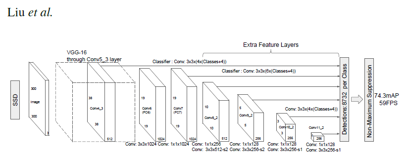
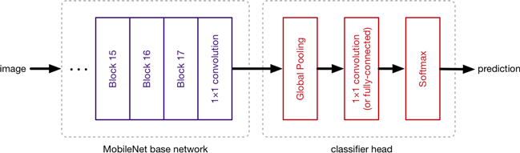

# Object Detection KTP (Kartu Tanda Penduduk)/Indonesia User's ID

Machine Learning engineer team repository of Traveloka OCR Project.

<p align="center">
    
</p>

## Getting Started

### Dataset

We collected the data from many sources as mentioned below:
- Google Image
- OpenSea
- Pinterest
- Bing Image

We collected the images only for learning purposes. Our goal is to collect the best and less noisy KTP.

We annotate images manually using [Roboflow](https://app.roboflow.com/). We only took 5 information from the KTP in the form of NIK, Name, Gender, Marital Status, and Nationality which would be used as a class. After the annotations are done, proceed to create a new version of our data set. We implemented preprocessing and augmentation in Roboflow. Then export the data for training to tfrecord.

Our dataset consists of 1.500 training data and 150 validation data. The training data has been augmented from 450 to 1.350 via Roboflow.

If you want to see our dataset, you can do the code below.

```
!pip install -q roboflow
from roboflow import Roboflow
rf = Roboflow(api_key="SXKaY7lyLrKyC4UwuCji")
project = rf.workspace("ktp-2wl90").project("final-ktp-od-v2")
dataset = project.version(1).download("tfrecord")
```

The code is run on Google Colabs or Jupyter Notebook. Or you can use my dataset here: [download](https://drive.google.com/drive/folders/1_0Wb2Y4eazmsUTe0e2wIB7uUUhZOZuzQ?usp=sharing).

### SSD MobileNet v2

SSD MobileNet v2 (Single Shot Detector MobileNet) is an object detection model with 267 layers and 15 million parameters. It provides real-time inference under computing limitations in devices such as smartphones. The SSD MobileNet v2 model is basically a 2 part model.

1. A MobileNetV2 base network with an SSD layer classifying the detected images.

<p align="center">
    
</p>

2. The MobileNet base network acts as a feature extractor for the SSD layer which will then classify the desired object.

<p align="center">
    
</p>

### Training

In this notebook, we use SSD MobileNet v2 with the TensorFlow Object Detection API to train custom object detection.

We use SSD MobileNet v2 from [TensorFlow 1 Detection Model Zoo](https://github.com/tensorflow/models/blob/master/research/object_detection/g3doc/tf1_detection_zoo.md).

> - Pretained model: [ssd_mobilenet_v2_coco_2018_03_29](http://download.tensorflow.org/models/object_detection/ssd_mobilenet_v2_coco_2018_03_29.tar.gz)
> - Pipeline config files: [ssd_mobilenet_v2_coco.config](https://github.com/tensorflow/models/blob/master/research/object_detection/samples/configs/ssd_mobilenet_v2_coco.config)

Please follow all the instructions on the .ipynb file. This file is explained in detail.

### Reference
- https://github.com/tensorflow/models
- https://blog.roboflow.com/getting-started-with-roboflow/
- https://github.com/roboflow-ai/tensorflow-object-detection-faster-rcnn
- https://github.com/Tony607/object_detection_demo
- https://blog.roboflow.com/training-a-tensorflow-object-detection-model-with-a-custom-dataset/
- https://blog.roboflow.com/how-to-train-a-tensorflow-lite-object-detection-model/

