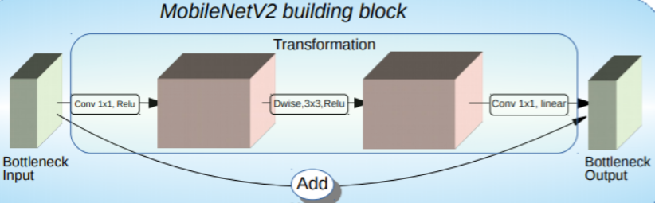

# traveloka-ocr-ml

Object Detection KTP (Kartu Tanda Penduduk) Indonesia/Indonesia User's ID

## Model Development

    

## Getting Started

### Dataset

After Collecting, we annotate images manually using [Roboflow](https://app.roboflow.com/). We only took 5 information from the KTP in the form of NIK, Name, Gender, Marital Status, and Nationality which would be used as a class.

| Demo Image  | Annotate | 
| ---         |     ---      | 
|     |     |  

After the annotations are done, proceed to create a new version of our data set. We implemented [preprocessing](https://docs.roboflow.com/image-transformations/image-preprocessing) and [augmentation](https://docs.roboflow.com/image-transformations/image-augmentation) in Roboflow. Then [export the data](https://docs.roboflow.com/exporting-data) for training to tfrecord.

We resized the dataset to 416x416 for a smaller file size and faster training. The training data has been augmented from 450 to 1.285 via Roboflow. Our dataset consists of 1.285 training data and 150 validation data.

| Before Augmentation | After Augmentation | 
| ---         |     ---      | 
|     |     | 

### Modelling

SSD MobileNet v2 (Single Shot Detector MobileNet) is an object detection model with 267 layers and 15 million parameters. It provides real-time inference under computing limitations in devices such as smartphones. The SSD MobileNet v2 model is basically a 2 part model.

- SSD as Object Localization and Classifier.

    

- MobileNetV2 as Feature Extraction and Classifier.

    

### Training

In [this notebook](https://github.com/capstone-bangkit-c22-ky01/traveloka-ocr-ml/blob/main/object-detection/Object%20Detection.ipynb), we use SSD MobileNet v2 with the TensorFlow Object Detection API to train custom object detection.

We use SSD MobileNet v2 from [TensorFlow 1 Detection Model Zoo](https://github.com/tensorflow/models/blob/master/research/object_detection/g3doc/tf1_detection_zoo.md).

- Pretained model: [ssd_mobilenet_v2_coco_2018_03_29](http://download.tensorflow.org/models/object_detection/ssd_mobilenet_v2_coco_2018_03_29.tar.gz)
- Pipeline config files: [ssd_mobilenet_v2_coco.config](https://github.com/tensorflow/models/blob/master/research/object_detection/samples/configs/ssd_mobilenet_v2_coco.config)

Please follow all the instructions on [this notebook](https://github.com/capstone-bangkit-c22-ky01/traveloka-ocr-ml/blob/main/object-detection/Object%20Detection.ipynb). This file is explained in detail.

### Demo

In [this notebook](https://github.com/capstone-bangkit-c22-ky01/traveloka-ocr-ml/blob/main/object-detection/Demo%20Object%20Detection.ipynb), we conducted several demos of Indonesian KTP (Identity Card)/Indonesian User ID Object Detection.

| Demo Image | Prediction Result | 
| ---         |     ---      | 
|     |     |  
|     |     |  
|     |     |  
|     |     |  
|     |     |  
|     |     |  

### Reference
1. [Liu, Wei., et al. (2016). SSD: Single Shot MultiBox Detector. European Conference on Computer Vision. ECCV 2016: Computer Vision – ECCV 2016 pp 21-37.](https://arxiv.org/abs/1512.02325)
2. [Sandler, Max., et al. (2018). MobileNetV2: Inverted Residuals and Linear Bottlenecks.](https://arxiv.org/abs/1801.04381)
3. https://github.com/tensorflow/models
4. https://blog.roboflow.com/getting-started-with-roboflow/
5. https://github.com/roboflow-ai/tensorflow-object-detection-faster-rcnn
6. https://blog.roboflow.com/training-a-tensorflow-object-detection-model-with-a-custom-dataset/
7. https://blog.roboflow.com/how-to-train-a-tensorflow-lite-object-detection-model/

