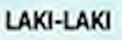

# traveloka-ocr-ml
Optical Character Recognition

## Model Development
 

## Training Process
### Dataset
We retrieve data that has been cutted by Object Detection model and then manually annotating the images into txt file. We took 5 information from the KTP in the form of NIK, Name, Gender, Marital Status, and Nationality which would be used as a class. 

### Data Preprocessing
After annotating, we preprocessed the images using **CV2** like below:
- Noise removal to remove noise i.e. unwanted dots and strips in ID card
- Grayscaling reduce image dimensionality
- Thresholding Onsu to project pixel value into binary (0 or 255)
  
Noise Removal for removing the noise, Thresholding Otsu, Grayscaling
| Demo images | Preprocessed | 
| ---         |     ---      | 
|     |     |  
|     |     |  
|     |     |  
|     |     |  
|     |     |  

### Create LMDB Dataset before training.
After preprocessing the images and annotating, we need to convert the datasets into **LMDB format** like below:
```py
pip3 install fire
python create_lmdb_dataset.py --inputPath data/ --gtFile data/gt.txt --outputPath result/
```
The structure of data folder as below.
```
data
├── gt.txt
└── train_data
    ├── image_1.png
    ├── image_2.png
    ├── image_3.png
    └── ...
```
At this time, `gt.txt` should be `{imagepath}\t{label}\n` <br>
For example
```
train_data/image_1.png 195153737373737
train_data/image_2.png GOOGLE BANGKIT ACADEMY
train_data/image_3.png qwertyuiop
...
```

### Modelling
We deeply inspired the model architecture from [ClovaAI](https://github.com/clovaai/deep-text-recognition-benchmark), which we create the architecture like below:
- Feature Extractor using VGG16 or ResNet
- Loss Function using CTC Loss

<p align="center">
    
</p>

Implementation of VGG16 (image from  [Researchgate.net](https://www.researchgate.net/figure/Fig-A1-The-standard-VGG-16-network-architecture-as-proposed-in-32-Note-that-only_fig3_322512435))


### Training
Because Indonesian KTP has 2 different fonts, in this case the first font is for NIK and the second font is for the rest attribute in Indonesian KTP. For the training we use command and pass some attribute in it. 

* `--train_data`: folder path to training lmdb dataset.
* `--valid_data`: folder path to validation lmdb dataset.
* `--select_data`: Path to all data folder. 
* `--batch_ratio`: assign ratio for each selected data in the batch. default is 0.5-0.5.when creating LmdbDataset. 
* `--Transformation`: select Transformation module [None | TPS].
* `--FeatureExtraction`: select FeatureExtraction module [VGG | RCNN | ResNet].
* `--SequenceModeling`: select SequenceModeling module [None | BiLSTM].
* `--Prediction`: select Prediction module [CTC | Attn].

Example command for training is : 
```py
python train.py --train_data result --valid_data result --select_data / --batch_ratio 0.5 --batch_size 2 --character 'abcdefghijlkmnopqrstuvwxyz,. -' --num_iter 60000 --Transformation None --FeatureExtraction VGG --SequenceModeling None --Prediction CTC
```

or if you want to use different architecture (ResNet) you can use :
```py
python train.py --train_data result --valid_data result --select_data / --batch_ratio 0.5 --batch_size 2 --character '0123456789' --num_iter 60000 --Transformation None --FeatureExtraction ResNet --SequenceModeling None --Prediction CTC
```

> Note : We only do test on both of those commands. For other options is still in development


## Demo

| Demo images  | prediction result |
| ---            |          --- |
|        |  3329091212121059   |
|      |  BORUTO   |
|      |  LAKI-LAKI   |
|      |  BELUM KAWIN   |
|      |  WNI   | 

## References
[1] J. Baek κ.ά., ‘What Is Wrong With Scene Text Recognition Model Comparisons? Dataset and Model Analysis’, στο International Conference on Computer Vision (ICCV), 2019